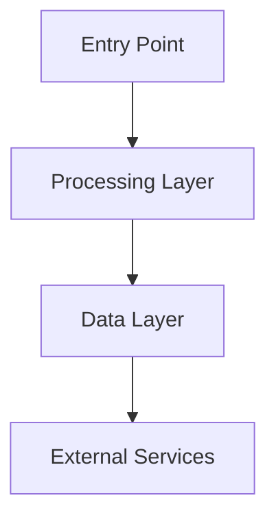

# Explore

Help engineers understand a codebase through guided exploration, producing diagrams, reports, and interactive artifacts.

## Context

Read `LEARNINGS.md` in this skill folder for edge cases and patterns discovered during use.

---

## Workflow Overview

```
┌─────────────┐     ┌─────────────┐     ┌─────────────┐     ┌─────────────┐
│    SCOPE    │ ──▶ │   EXPLORE   │ ──▶ │ SYNTHESIZE  │ ──▶ │   DELIVER   │
│             │     │             │     │             │     │             │
│ • What area │     │ • Subagents │     │ • Narrative │     │ • Diagrams  │
│ • How deep  │     │ • Trace     │     │ • Structure │     │ • Report    │
│ • What form │     │ • Map deps  │     │ • Patterns  │     │ • HTML      │
└─────────────┘     └─────────────┘     └─────────────┘     └─────────────┘
```

---

## Phase 1: SCOPE

**Goal:** Understand exactly what the engineer wants to learn and how they want to consume it.

### 1.1 What to Learn

Ask the engineer what they want to understand. Common requests:

| Request Type | Example | Exploration Strategy |
|-------------|---------|---------------------|
| **Full architecture** | "How is this repo structured?" | Top-down: entry points → layers → key modules |
| **Feature deep-dive** | "How does the call flow work?" | End-to-end: trigger → processing → output |
| **Data flow** | "How does data move from webhook to DB?" | Trace: entry point → transformations → persistence |
| **Single component** | "What does this service do?" | Focused: the file, its dependencies, its consumers |
| **System interaction** | "How do torrent and seabird talk?" | Cross-boundary: APIs, queues, shared data |
| **Design decisions** | "Why is it built this way?" | Archaeological: git history, patterns, trade-offs |

### 1.2 How Deep

| Depth | What You Get | Time |
|-------|-------------|------|
| **Overview** | Architecture diagram + 1-paragraph summaries per module | Fast |
| **Standard** | Diagrams + report with data flows, patterns, key files | Medium |
| **Deep dive** | Everything above + interactive HTML explorer + code walkthroughs | Longer |

If the engineer doesn't specify, default to **Standard**.

### 1.3 What Format

Ask which artifacts they want (can select multiple):

| Artifact | Description |
|----------|------------|
| **Diagrams** | Mermaid diagrams rendered in terminal (architecture, data flow, sequence, ER, state) |
| **Report** | Markdown document saved to `docs/studies/{topic}.md` |
| **Interactive HTML** | Self-contained `.html` file at `docs/studies/{topic}.html` — open in browser |
| **Walkthrough** | Conversational explanation right here in the session |

If the engineer doesn't specify, default to **Diagrams + Walkthrough**.

---

## Phase 2: EXPLORE

**Goal:** Deep codebase exploration to gather all the information needed.

### 2.1 Context Window Protection

**MANDATORY: Use subagents for all heavy file reading.**

Exploring a codebase means reading many files. Reading them directly fills the main session context. Always use the Task tool with `subagent_type: "Explore"` to read files and return focused summaries.

```
Task tool:
  subagent_type: "Explore"
  prompt: |
    Explore {specific area} in the codebase at {repo_path}.

    I need to understand:
    - {specific questions}

    Read the relevant files and return:
    1. Key files and their roles (path + 1-line description)
    2. How they connect (what calls what, data flow)
    3. Patterns used (naming, architecture, error handling)
    4. Entry points (where does execution start?)

    Return as structured markdown. Do NOT return raw file contents.
```

### 2.2 Exploration Strategies

#### For full architecture:

Spawn parallel subagents:

```
Agent 1: "Read package.json, tsconfig, project structure. Map the top-level modules,
          entry points, and build system."
Agent 2: "Read route files and API endpoints. Map URL → handler → service."
Agent 3: "Read data models/schemas. Map collections, relationships, indexes."
Agent 4: "Read config, env, and infrastructure files. Map external dependencies."
```

#### For feature deep-dive:

Spawn sequential subagents (each builds on the previous):

```
Agent 1: "Find the entry point for {feature}. What triggers it? Read the trigger
          handler and return: function name, file path, what it does, what it calls."

Agent 2: "Starting from {entry point from Agent 1}, trace the execution path.
          Read each file in the chain. Return the full call chain with data
          transformations at each step."

Agent 3: "For the feature {feature}, read all related test files, error handlers,
          and edge case handling. Return: how it fails, how errors propagate,
          what's tested."
```

#### For data flow:

```
Agent 1: "Trace how {data} enters the system. Find webhook handlers, API routes,
          or queue processors that receive this data. Return entry points."

Agent 2: "From {entry points}, trace how {data} is transformed, validated, enriched,
          and stored. Read each transformation step. Return the pipeline."

Agent 3: "Find where {data} is read back / consumed. What queries it? What
          depends on it? Return consumers and their access patterns."
```

### 2.3 What to Capture

During exploration, build a mental model of:

- **Layers**: What are the architectural layers? (routes → services → models? controllers → use-cases → repos?)
- **Key files**: Which files are most important? (entry points, core services, data models)
- **Patterns**: What conventions does the codebase follow? (naming, error handling, dependency injection)
- **Data flow**: How does data enter, transform, and persist?
- **Dependencies**: What external services, databases, queues does it use?
- **Entry points**: Where does execution start? (HTTP routes, queue processors, cron jobs, event handlers)
- **Cross-cutting concerns**: Auth, logging, error handling, validation — how are they done?

---

## Phase 3: SYNTHESIZE

**Goal:** Organize raw exploration findings into a coherent narrative.

### 3.1 Structure the Understanding

Organize findings into these sections (adapt based on what was explored):

1. **Overview** — What is this? What problem does it solve? (1-2 sentences)
2. **Architecture** — Layers, modules, how they connect
3. **Key Components** — Most important files/modules with their roles
4. **Data Flow** — How data moves through the system (with diagram)
5. **Patterns & Conventions** — Design patterns, naming conventions, architectural decisions
6. **External Dependencies** — Services, databases, APIs it depends on
7. **Entry Points** — Where execution begins (routes, processors, handlers)
8. **Key Design Decisions** — Why it's built this way (if discoverable)

### 3.2 Choose Diagram Types

Based on what was explored, select the most useful diagrams:

| What You're Showing | Diagram Type | Mermaid Syntax |
|---------------------|-------------|---------------|
| System components and their relationships | Architecture (flowchart) | `flowchart TD` |
| Request/response flow between components | Sequence diagram | `sequenceDiagram` |
| Data moving through transformations | Data flow (flowchart) | `flowchart LR` |
| Database collections and relationships | ER diagram | `erDiagram` |
| State transitions | State diagram | `stateDiagram-v2` |
| Class/module hierarchy | Class diagram | `classDiagram` |
| Module dependencies | Dependency graph (flowchart) | `flowchart BT` |

**Rule:** Every exploration should produce at least ONE diagram. Diagrams communicate architecture faster than text.

---

## Phase 4: DELIVER

**Goal:** Produce the requested artifacts.

### 4.1 Diagrams (Terminal)

Render Mermaid diagrams directly in the conversation. The engineer sees them immediately.



**Tips:**
- Keep diagrams focused — one concept per diagram
- Use clear labels (not file paths — use component names)
- Add annotations for non-obvious connections
- If the system is large, produce multiple focused diagrams rather than one huge one

### 4.2 Technical Report (Markdown)

Save to `docs/studies/{topic}.md` in the repo.

**Template:**

```markdown
# {Topic} — Technical Study

**Date:** {date}
**Scope:** {what was explored}
**Depth:** {overview | standard | deep dive}

## Overview
{1-2 sentence summary}

## Architecture
{Architecture diagram}

{Description of layers and how they connect}

## Key Components

| Component | File(s) | Role |
|-----------|---------|------|
| {name} | `{path}` | {what it does} |

## Data Flow
{Data flow diagram}

{Step-by-step description of how data moves}

## Patterns & Conventions
- **{Pattern}** — {how it's used, where}

## External Dependencies

| Dependency | Type | Used For |
|-----------|------|----------|
| {name} | DB / API / Queue / etc. | {purpose} |

## Entry Points

| Entry Point | Type | File | Triggers |
|------------|------|------|----------|
| {name} | Route / Queue / Cron | `{path}` | {what triggers it} |

## Key Design Decisions
- **{Decision}** — {why, alternatives considered if discoverable}
```

### 4.3 Interactive HTML Explorer

Save to `docs/studies/{topic}.html` in the repo. A single self-contained HTML file that opens in any browser.

**MANDATORY: The HTML must be completely self-contained.**
- All CSS inline (no external stylesheets)
- All JS inline (no external scripts EXCEPT Mermaid CDN for diagram rendering)
- No build step required — just open the file in a browser

**HTML Explorer Template Structure:**

```html
<!DOCTYPE html>
<html lang="en">
<head>
    <meta charset="UTF-8">
    <meta name="viewport" content="width=device-width, initial-scale=1.0">
    <title>{Topic} — Code Explorer</title>
    <script src="https://cdn.jsdelivr.net/npm/mermaid/dist/mermaid.min.js"></script>
    <style>
        /* Include all styles inline */
        /* Dark theme, monospace fonts, collapsible sections */
        /* Syntax highlighting for code snippets */
        /* Responsive layout */
    </style>
</head>
<body>
    <!-- Navigation sidebar -->
    <!-- Main content area with sections -->
    <!-- Mermaid diagrams -->
    <!-- Collapsible module details -->
    <!-- Code snippets with syntax highlighting -->
    <!-- Search/filter functionality -->

    <script>
        mermaid.initialize({ startOnLoad: true, theme: 'dark' });
        // Collapsible sections
        // Search functionality
        // Smooth scrolling navigation
    </script>
</body>
</html>
```

**What the HTML explorer should include:**

1. **Navigation sidebar** — Clickable table of contents for all sections
2. **Architecture diagram** — Mermaid diagram rendered at the top
3. **Module cards** — Collapsible cards for each key component:
   - Name and role
   - Key files (with paths)
   - Dependencies (what it uses)
   - Consumers (what uses it)
   - Code snippet showing the core pattern
4. **Data flow section** — Step-by-step with diagram
5. **Dependency graph** — Visual map of what depends on what
6. **File index** — Searchable list of all key files with annotations
7. **Search** — Filter modules/files by keyword

**Design principles for the HTML:**
- Dark theme (developer-friendly)
- Monospace fonts for code, sans-serif for prose
- Collapsible sections (don't overwhelm — let them drill down)
- Responsive (works on laptop and wide monitor)
- Print-friendly (for those who want a PDF)
- Fast — no framework bloat, vanilla JS only

### 4.4 Walkthrough (Conversational)

Explain the findings directly in the conversation. Structure as:

1. Start with the big picture ("Here's how this system works at a high level...")
2. Show the architecture diagram
3. Walk through the key components
4. Trace a specific flow end-to-end ("Let me trace what happens when a webhook arrives...")
5. Highlight interesting design decisions or patterns
6. Note areas that are unusual, complex, or potential gotchas

---

## Combining Artifacts

When the engineer asks for multiple artifacts, produce them in this order:

1. **Walkthrough** first (immediate value, engineer understands while artifacts are being written)
2. **Diagrams** during the walkthrough (visual aids for the conversation)
3. **Report** after the walkthrough (persistent reference)
4. **Interactive HTML** last (most complex to generate, benefits from all the understanding built above)

---

## Adapting to Scope

### Small scope (single file/function)

- Skip subagents — read directly
- Produce: walkthrough + 1 diagram
- No report or HTML needed unless requested

### Medium scope (feature/module)

- 1-2 subagents for exploration
- Produce: walkthrough + diagrams + report
- HTML if requested

### Large scope (full repo architecture)

- 3-4 parallel subagents
- Produce: all artifacts
- HTML explorer is especially valuable here

---

## Anti-Patterns

| Don't | Do Instead |
|-------|------------|
| Read all files directly in main session | Use Explore subagents — protect context window |
| Produce a wall of text with no diagrams | Lead with diagrams, support with text |
| List every file in the repo | Focus on key files that matter for understanding |
| Explain implementation details before architecture | Start high-level, drill down on request |
| Produce artifacts without asking what format | Ask what the engineer wants (Phase 1.3) |
| Make the HTML depend on external resources | Self-contained except Mermaid CDN |
| Generate one massive diagram | Multiple focused diagrams are better than one huge one |

---

## Related Skills
- [[implement]] — after understanding, engineers may want to build
- [[ideate]] — understanding existing architecture informs new feature planning
- [[debug]] — understanding architecture helps locate bugs

## Self-Improvement

After completing this skill, if you discovered:
- A better exploration strategy for a specific repo structure
- An artifact format that worked particularly well
- An edge case in HTML generation

Then **automatically** invoke the `/improve` skill to:
1. Add the learning to `LEARNINGS.md` in this skill folder
2. Update `SKILL.md` if it's a core instruction change
3. Commit and push
